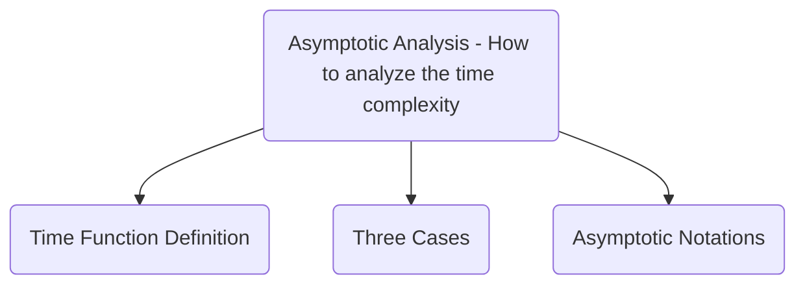

# Selection Sort Research Report

## Executive Summary

## Algorithm

### <ins>Selection Sort</ins>
1.  Get a list of unsorted elements `LIST`
2. Iterate through the list storing the current index as `CURRENT`.
3. Store the value of the `CURRENT` index in `TEMP`
4. Iterate through the remaining items storing the index of the lowest value as `LOWEST_IDX` 
5. Move the value of the item at `LOWEST_IDX` to the item at `CURRENT` 
     `LIST[CURRENT] = LIST[LOWEST_IDX]`
6. Move the value `TEMP` to the item at `LOWEST_IDX`
    `LIST[LOWEST_IDX] = TEMP`

### Pseudocode
```
input LIST
for CURRENT from 0 to length(LIST) do
	TEMP <- LIST[CURRENT]
	LOWEST_IDX <- CURRENT
    for SEARCH from CURRENT to length(LIST) do
	    if LIST[SEARCH] < LIST[LOWEST_IDX] then
		    LOWEST_IDX <- SEARCH
	    endif
    endfor
    LIST[CURRENT] <- LIST[LOWEST_IDX]
    LIST[LOWEST_IDX] <- TEMP
endfor
return LIST
```
### Implementation Example (Python)
```python
def selection_sort(l):
    for c in range(len(l)):
        tmp = l[c]
        lowest_idx = c
        for s in range(c, len(l)):
            if l[s] < l[lowest_idx]:
                lowest_idx = s
        l[c] = l[lowest_idx]
        l[lowest_idx] = tmp
    return l
```
## Asymptotic Analysis



### Time Function Definition
```c
voic function(int n[]) {
	int tmp, lowest_idx;                    // 2
	for (int i = 0, i < sizeof(n), i++) {   // n + 1
		tmp = n[i]                          // n
		lowest_idx = i                      // n
		for (j = i, j < sizeof(n), j++)     // n * n + 1
			if n[j] < n[lowest_idx]         // n * n
				lowest_idx = j              // n * n
		l[i] = l[lowest_idx]                // n
		l[lowest_idx] = tmp	                // n
	}
}
```

$T(n) = 2 + (n + 1) + n + n + (n * (n + 1)) + n^2 + n^2 + n + n$

$T(n) = 3n^2 + 6n + 3$

#### Asymptotic Analysis Rule #1

$T(n) = 3n^2$

#### Asymptotic Analysis Rule #2

$T(n) = n^2$
### Three Cases

#### Big O

The function $f(n) = O(g(n)) \iff \exists$ two Constants $C$ and $k$ such that $f(n) <= C \cdot g(n) \forall n >= k$

#### Big $\Omega$ 

The function $f(n) = \Omega(g(n)) \iff \exists$ two Constants $C$ and $k$ such that: $f(n) >= C \cdot g(n) \forall n >= k$

#### Big $\Theta$

The function $f(n) = \Theta(g(n)) \iff \exists$  three Constants $C_1$, $C_2$ ,and $k$ such that: $C_1 \cdot g(n) <= f(n) <= C_2 \cdot g(n) \quad \forall n >= k$

### Asymptotic Notations
