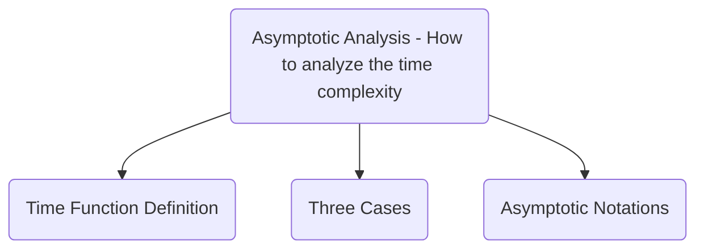

# Selection Sort Research Report

## Executive Summary

## Algorithm

## Pseudocode

## Asymptotic Analysis

### Time Function Definition

### Three Cases

#### Big O

The function $f(n) = O(g(n)) \iff \exists$ two Constants $C$ and $k$ such that $f(n) <= C \cdot g(n) \forall n >= k$

#### Big $\Omega$ 

The function $f(n) = \Omega(g(n)) \iff \exists$ two Constants $C$ and $k$ such that: $f(n) >= C \cdot g(n) \forall n >= k$

#### Big $\Theta$

The function $f(n) = \Theta(g(n)) \iff \exists$  three Constants $C_1$, $C_2$ ,and $k$ such that: $C_1 \cdot g(n) <= f(n) <= C_2 \cdot g(n) \quad \forall n >= k$

### Asmyptotic Notations
